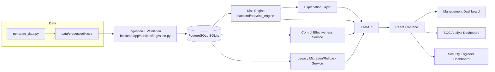

# Architecture

## System overview



## Data flow (the story the system tells)

```
Security Telemetry
   -> Controls (coverage/compliance over time)
   -> Assets (criticality, exposure)
   -> Vulnerabilities (severity, exploitability)
   -> Incidents (realized harm)
   -> Remediation (response)
   -> Risk Calculation (transparent weighted formula)
   -> Control Effectiveness (before/after comparison)
   -> Business Risk (0-100 score + band)
   -> Explanation (deterministic, evidence-grounded)
   -> Evidence (drill-down: asset -> vuln/incident -> control -> telemetry)
   -> Management Decision
```

## Layers

- **Data generation** (`data/generate_data.py`): produces synthetic BASELINE
  and CURRENT period data with deliberately injected data-quality issues.
- **Ingestion & validation** (`backend/app/services/ingestion.py`): loads CSVs
  into the database, clamping/flagging invalid values into
  `data_quality_events` rather than crashing.
- **Risk engine** (`backend/app/risk_engine/`): pure-Python, dependency-free,
  fully unit-testable scoring + explanation logic (see `risk_methodology.md`).
- **Services** (`backend/app/services/`): compose the risk engine with
  database queries — org/asset risk, control effectiveness, legacy migration.
- **API** (`backend/app/api/`): FastAPI routers, one per resource area, all
  reading through the services layer (no business logic in route handlers).
- **Frontend** (`frontend/src/`): React + Vite + Tailwind, role-based
  dashboards, drill-down evidence pages, and a legacy/rollback demo page.

## Why the risk engine is dependency-free

The risk engine (`app/risk_engine/engine.py` and `explain.py`) imports
nothing beyond the Python standard library. This was a deliberate design
choice: it means the core, most safety-critical logic can be unit tested
without a database, without FastAPI, and without network access — which is
exactly how it was validated during development of this prototype.

## Authorization model

All API endpoints require authentication (`get_current_user`, a valid JWT
from `POST /api/auth/login`) — an anonymous request to any endpoint returns
401. Beyond that baseline, role enforcement is layered as follows:

| Endpoint group | Enforcement |
|---|---|
| `GET /api/dashboard/management` | `management` only |
| `GET /api/dashboard/soc` | `soc_analyst`, `management` |
| `GET /api/dashboard/engineering` | `security_engineer`, `management` |
| `POST /api/legacy/migrate`, `/verify`, `/rollback` | `management`, `security_engineer` (state-changing actions) |
| Everything else (risk, controls, assets, vulnerabilities, incidents, remediation, data-quality, legacy status/audit-log) | any authenticated role |

**Documented rationale:** the three top-level role dashboards are the
primary, directly-testable access boundary the brief calls out ("management
should have access to the management dashboard," etc.), and are strictly
enforced. Evidence-level data (assets, vulnerabilities, incidents, controls,
remediation, data-quality) is intentionally left open to any authenticated
SOC staff member, because the required drill-down demonstration explicitly
has Management view vulnerabilities, incidents, control telemetry, and
remediation as evidence during the same session — restricting those
endpoints to a single role would break that flow. Legacy migration/rollback
is restricted to the two roles capable of making that operational decision.
This is a considered design trade-off, not an oversight — a stricter model
(every resource scoped to exactly one role) is a straightforward follow-up
if a real deployment's compliance requirements call for it.

The frontend (`frontend/src/App.jsx`, `RoleRoute`) mirrors this with route
guards, but the frontend guard is UX convenience only — the backend
independently enforces the same boundaries regardless of what the frontend
does or doesn't hide, so a user typing an API URL directly cannot obtain
data their role-guarded dashboard endpoint would deny them.

## Assumptions made (documented, not hidden)

- No production-grade external telemetry sources exist, so this project uses
  a synthetic generator with two time periods (BASELINE ~90 days ago, CURRENT
  recent) instead of live feeds.
- SQLite is used as a zero-dependency local fallback; Postgres is the primary
  target via docker-compose, per the required stack.
- Vulnerability "before" state is approximated from the synthetic dataset's
  discovered/remediated fields rather than a dedicated point-in-time snapshot
  table (documented in `control_effectiveness.py`).
- The optional LLM explanation layer is a rewording/summarization pass over
  the deterministic explanation, never a source of new claims.
